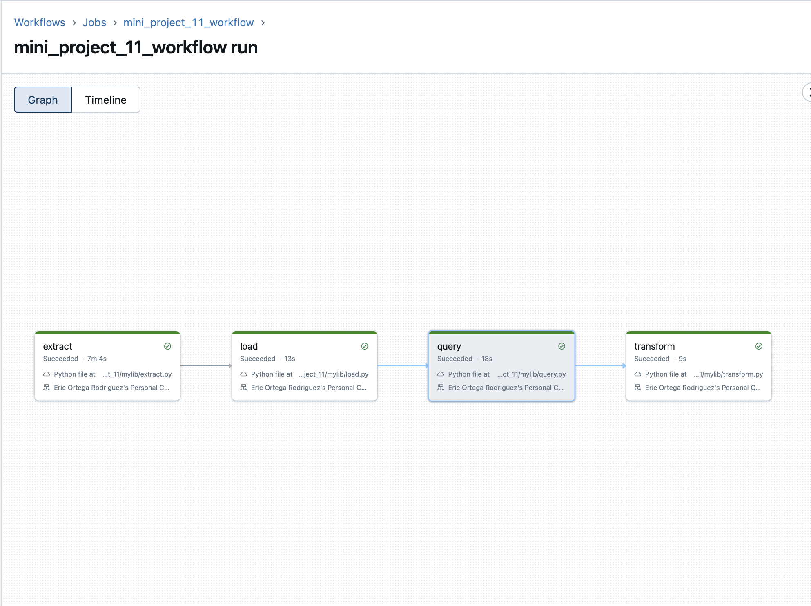

[](https://github.com/nogibjj/Eric_Ortega_Rodriguez_Mini_Project_6/actions/workflows/cicd.yml)
# Data Pipeline with Databricks

## Overview
This project demonstrates a data pipeline implemented using Databricks. The pipeline performs the following tasks:

- Extracts data from a specified source.
- Transforms the data using Databricks workflows.
- Loads the transformed data into a data sink for further analysis or storage.

## Requirements
The pipeline includes:
- At least one data source.
- At least one data sink.

## Grading Criteria
1. **Pipeline Functionality (20 points)**: Ensure the pipeline processes data end-to-end, transforming raw data into a usable format.
2. **Data Source and Sink Configuration (20 points)**: Correctly configure the data source and data sink in Databricks.
3. **CI/CD Pipeline (10 points)**: Set up a CI/CD pipeline for deployment and automation.
4. **README.md (10 points)**: Provide clear documentation for the project.

## Deliverables
- A Databricks notebook or Python script implementing the pipeline.
- Documentation or video demonstrating the pipeline's functionality.
- Submission of the project via a public repository URL.

## Pipeline Components

### Data Source
Specify the input data source, such as:
- Cloud storage (e.g., AWS S3, Azure Blob Storage, or Google Cloud Storage).
- Databricks File System (DBFS).
- An external database.

### Data Transformation
- Handle missing values.
- Standardize data formats.
- Implement any business-specific transformations.

### Data Sink
Store the transformed data in:
- Cloud storage.
- Databricks Delta Tables.
- External databases.

## CI/CD Pipeline
Ensure continuous integration and deployment by:
- Using GitHub Actions or Azure DevOps to automate testing and deployment.
- Validating the pipeline functionality through unit tests.

## Functions Included in the Pipeline

### Extract Function
The `extract_data` function downloads data from a specified URL or retrieves it from a local file path. This function ensures that the required data is available for processing.

### Load Function
The `load_data` function reads the extracted data into a pandas DataFrame, handling file encoding issues and providing a structure for subsequent transformations.

### Query Function
The `query_data` function filters the loaded data based on specified conditions, enabling targeted analysis and data exploration.

### Transform Function
The `transform_data` function processes the queried data by:
- Filling missing values.
- Renaming columns for consistency.
- Applying business-specific transformations.

## How to Run
1. Clone the repository:
   ```bash
   git clone <repository-url>
   cd <repository-directory>
   ```

2. Open the Databricks notebook or script in your Databricks workspace.

3. Configure the following:
   - Data source and sink paths.
   - Any necessary credentials or configurations.

4. Run the pipeline in Databricks.

## Project Repository
Submit your project via a public repository URL containing:
- The pipeline notebook or script.
- Supporting files (e.g., sample data, configuration files).
- README.md.

## Example Repository Structure
```
project-root/
├── notebooks/
│   └── databricks_pipeline_notebook.dbc
├── scripts/
│   └── pipeline_script.py
├── data/
│   └── sample_data.csv
├── tests/
│   └── test_pipeline.py
├── .github/
│   └── workflows/
│       └── ci-cd.yml
└── README.md
```


